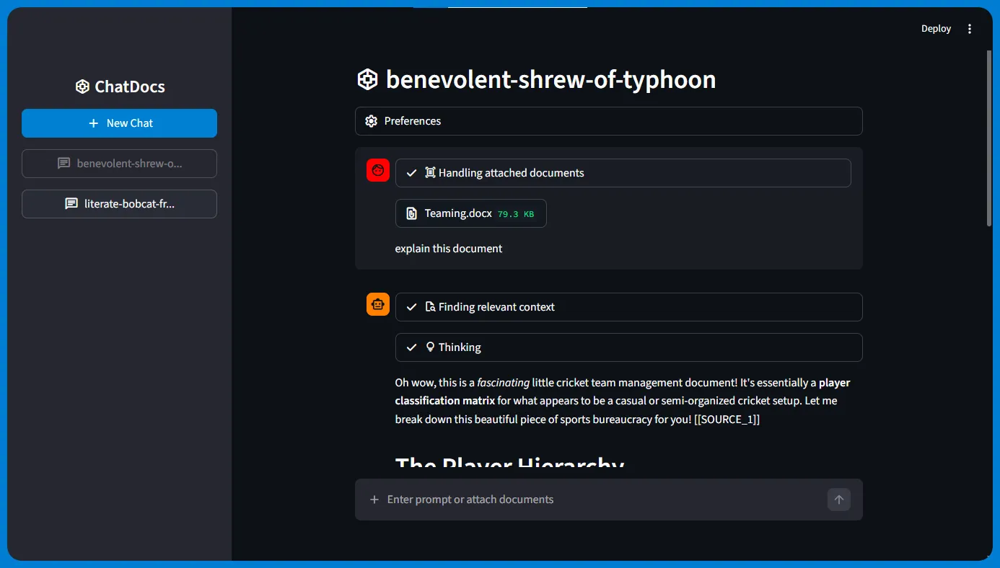
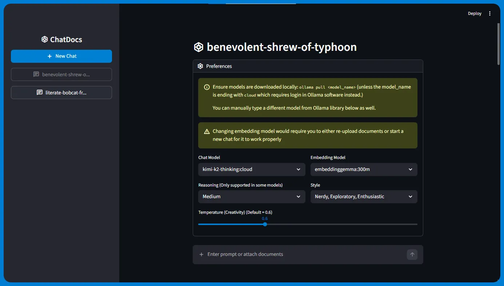

# ֎ ChatDocs

Chat with LLMs, attach documents, create multiple chats!

## In this project, I worked with:

- LangChain
- Ollama
- RAG
- Text Splitters (Recursive Character, Markdown Header)
- Document Loaders (PDF, DOCX, TXT, MD, CSV)
- Storing embeddings in Vector stores (Chroma)
- Custom Web Searching to add context via DuckDuckGo
- Streamlit
- SQLite
- Python

## Main Procedure:

- File contents are broken into small chunks (like paragraphs) (with overlaps to maintain some context).
- They are turned into an embedding vector (one chunk has one embedding vector) using embedding model. This embedding represents the meaning of the chunk.
- The chunk and its vector are stored in a vector store.
- A top-K similarity search is conducted in the vector store with respect to the user query/prompt.
- Context (i.e. the top K similar results concatenated) is provided, to the LLM, within the prompt.
- A history of the conversation is maintained which is fed to the LLM each time a user prompts.

## How to run?

1. Clone repo
1. `python -m venv .venv` to create a virtual environment
1. `pip install -r requirements.txt`
1. Install Ollama from [https://ollama.com/](https://ollama.com/)
1. `python src/setup.py` to initialize database etc
1. `streamlit run src/run.py`

----

<!-- #### TODOS:

- add youtube transcripts
- add website content reading
- add xlsx
- stop response in middle
- make relevant content getting better
- learn about retrievalQA -->
<!-- - add user auth -->
<!-- - changing preferences in the middle of response stops it (reruns the flow) -->
- ~~add better docx reader~~
- ~~add custom web search~~
- ~~catch errors regarding not logged in or network error or other ollama errors~~
- ~~add citations~~
- ~~delete chat~~
- ~~add thinking models functionality~~
- ~~add sqlite3~~
- ~~some statuses should be inside ai chat message, not human~~
- ~~make readme better with new images~~
- ~~make system message / CONTEXT, PROMPT, etc better~~
- ~~last prompt time based ordering of sidebar chats~~, sidebar items not updating order until rerun
- ~~add option of using whichever model~~
- ~~add option of choosing style~~
- ~~convert to ChatPromptTemplate~~
- ~~fix .md file not being read correctly~~
- ~~check session storage keys of preferences and change chat if embedding model changed~~
