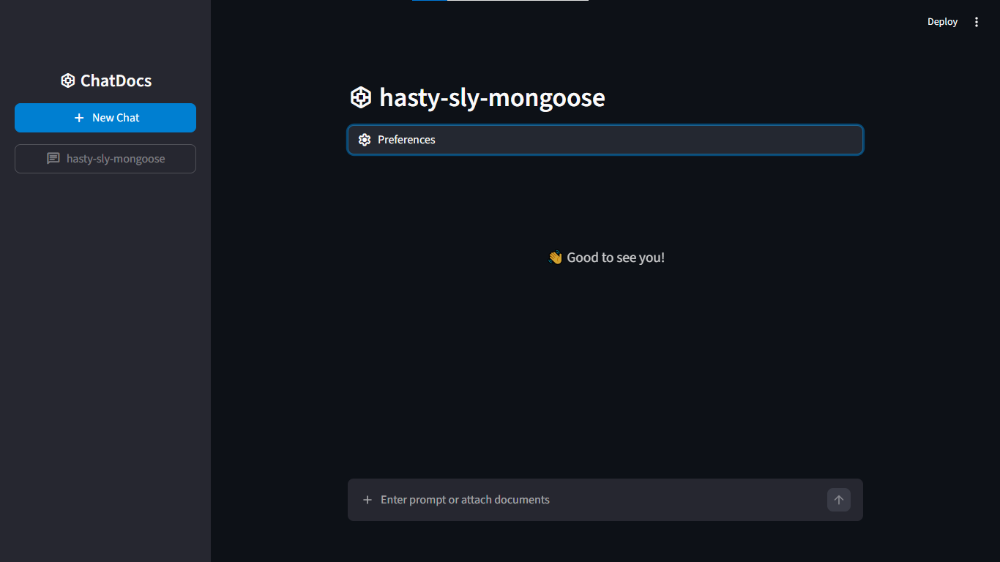

# 🌀 Chat with Docs

Chat with LLM, attach documents, create multiple chats!

### TODOS:

- ~~last prompt time based ordering of sidebar chats~~, sidebar items not updating order until rerun
- make readme better with new images
- make system message / CONTEXT, PROMPT, etc better
- add option of using whichever model
- add option of choosing style
- add sqlite3
- fix .md file not being read correctly
- add youtube transcripts
- add website content reading
- make relevant content getting better
- learn about retrievalQA
- add user auth

### In this project, I worked with:

- LangChain
- Ollama
- Text splitters (Recursive Character)
- Document Loaders (PDF, DOCX, TXT, MD, CSV)
- Vectorstores (Chroma)
- Streamlit
- Python

### Main Procedure:

- File contents are broken into small chunks (like paragraphs) (with overlaps to maintain some context).
- They are turned into an embedding vector (one chunk has one embedding vector) using embedding model. This embedding represents the meaning of the chunk.
- The chunk and its vector are stored in a vector store.
- A top-K similarity search is conducted in the vectorstore with respect to the user query/prompt.
- Context (i.e. the top K similar results concatenated) is provided, to the LLM, within the prompt.
- A history of the conversation is maintained which is fed to the LLM each time a user prompts.
